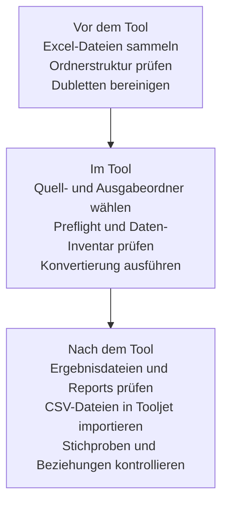
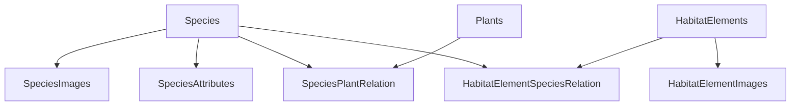
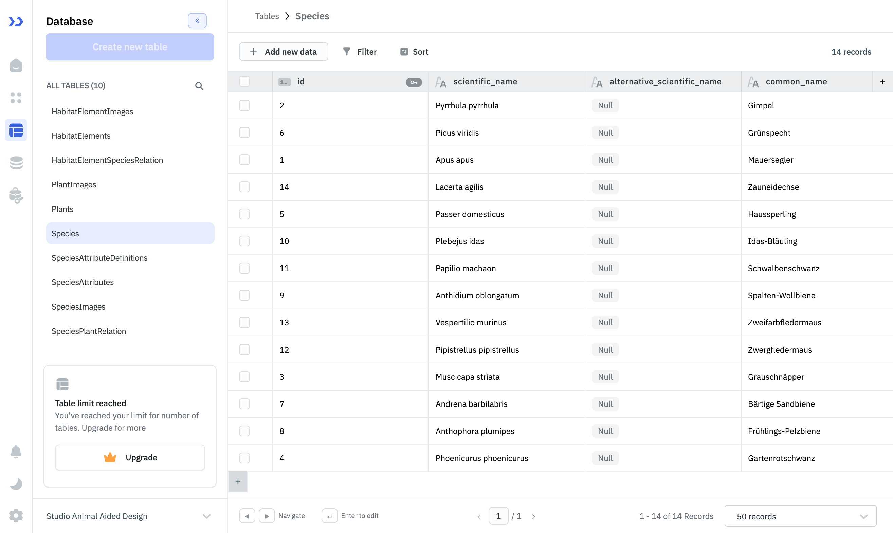
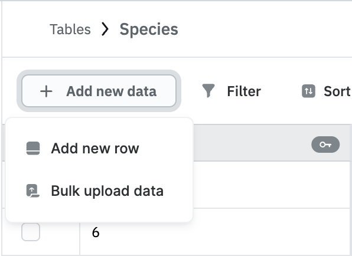
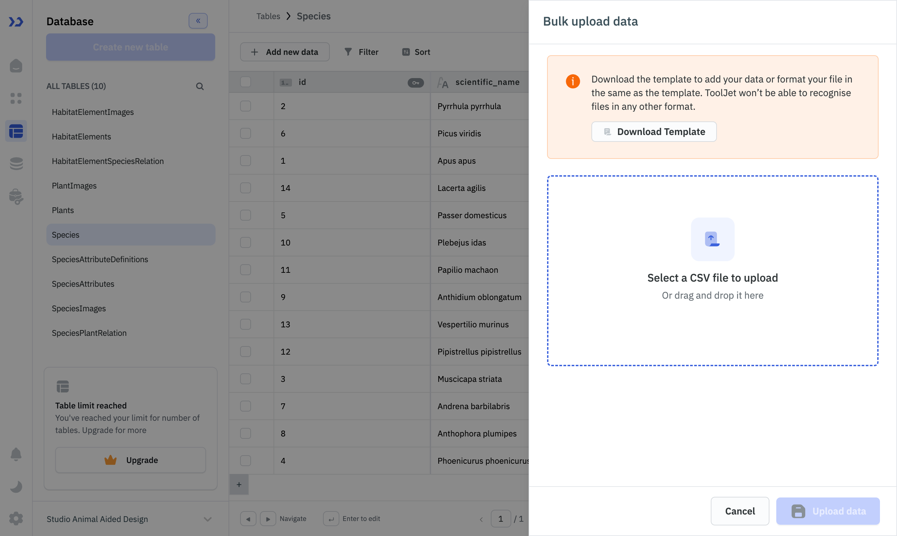

# AAD Tooljet Converter Handbuch

## 1. Zweck des Tools

Der AAD Tooljet Converter ist die lokale Desktop-Anwendung zur Umwandlung der fachlichen Excel-Quelldaten in CSV-Dateien für die Habitat-Datenbank in Tooljet.

Das Tool ersetzt die bisherigen Jupyter-Notebooks für den Normalbetrieb. Es richtet sich an nicht-technische Anwenderinnen und Anwender, die:

- Excel-Dateien aus der Facharbeit erhalten oder pflegen
- diese Dateien lokal prüfen und konvertieren müssen
- die generierten CSV-Dateien anschließend in Tooljet importieren

Das Tool deckt nicht nur die Konvertierung selbst ab, sondern auch:

- Vorprüfung der Eingangsdaten
- Sichtprüfung von Eingabe- und Ausgabedateien
- strukturierte Fehler- und Warnhinweise
- Import-Hilfe für Tooljet
- Konvertierungsberichte für Support und Nachvollziehbarkeit

## 2. Gesamtprozess Ende zu Ende

Der Gesamtprozess besteht aus drei Phasen:



1. Vor dem Tool
- Excel-Dateien sammeln, benennen und im erwarteten Ordnerlayout ablegen
- prüfen, ob die benötigten Arbeitsblaetter vorhanden sind
- prüfen, ob keine veralteten oder temporaeren Duplikate im Datenordner liegen

2. Im Tool
- Quellordner und Ausgabeordner wählen
- Daten-Inventar und Preflight prüfen
- Konvertierung starten
- Warnungen, Fehler, Reports und Ergebnisdateien prüfen

3. Nach dem Tool
- CSV-Dateien in Tooljet in der richtigen Reihenfolge importieren
- Zeilenanzahlen und Beziehungen kontrollieren
- in der Tooljet-App fachliche Stichproben durchführen
- Berichte archivieren oder an den Support weitergeben

## 3. Voraussetzungen

### 3.1 Für Endnutzer mit App-Bundle

| Bereich | Anforderung | Hinweis |
|---|---|---|
| Betriebssystem | macOS | Die Release-App wird als macOS-App verteilt. |
| Anwendung | Entpacktes Release-Verzeichnis mit `AAD-Tooljet-Converter.app` | Die App muss nicht aus dem Projekt heraus gestartet werden. |
| Quelldaten | Zugriff auf die Excel-Quelldaten | Die Daten müssen in der erwarteten Ordnerstruktur vorliegen. |

## 4. Erwartete Ordnerstruktur

Standard-Quellordner:

```text
habitat-database/data/
  species-portraits/
    classification/
    attribute-definitions/
    images/
    portraits/
  plants/
  habitat-elements/
```

Standard-Ausgabeordner:

```text
habitat-database/dist/conversion-output/
```

Die App kann andere Ordner verwenden, solange das gleiche relative Layout der Eingaben vorhanden ist.

## 5. Eingabedaten: benötigte Dateien und Anforderungen

| Datenart | Erwarteter Ort | Erwartung | Kritische Hinweise |
|---|---|---|---|
| Artenklassifikation | `species-portraits/classification/*.xlsx` | genau eine aktive Datei | erste Tabelle wird gelesen; dient als Basis für Species |
| Attribut-Definitionen | `species-portraits/attribute-definitions/*.xlsx` | genau eine aktive Datei | Blatt `Portrait` erforderlich |
| Arten-Bilder | `species-portraits/images/*.xlsx` | optional, aber empfohlen | erste vier Spalten sind positionsbasiert |
| Arten-Portraits | `species-portraits/portraits/*.xlsx` | mehrere Dateien möglich, je Art eine Datei | Blatt `Portrait` zentral; `Pflanzenliste` toleriert optional |
| Pflanzen-Master | `plants/*Pflanzenliste_Pflanzentyp_Datenbank.xlsx` | genau eine aktive Datei | erste sieben Spalten sind positionsbasiert |
| Habitat-Elemente | `habitat-elements/*NEB AAD Habitatelemente Zielarten.xlsx` | genau eine aktive Datei | zwei Blätter erforderlich: `Habitatelemente`, `Habitatelemente_Zielarten` |

### 5.1 Artenklassifikation

Erwarteter Ort:

```text
species-portraits/classification/*.xlsx
```

Verhalten:

- es wird genau eine aktive Datei erwartet
- bei mehreren Treffern wählt die App die neueste Datei und erzeugt eine Warnung
- gelesen wird das erste Arbeitsblatt der Datei

Fachlich benötigte Inhalte:

- wissenschaftlicher Artname
- deutscher Artname
- Klasse, Ordnung, Familie, Gattung

Tolerierte Spaltenvarianten für den wissenschaftlichen Namen:

- `Art_lat`
- `scientific_name`
- `name_wissenschaftlich`
- `wissenschaftlicher_name`

Tolerierte Spaltenvarianten für weitere Felder:

- `Art_dt`, `Art_dt2`
- `Klasse_dt`, `Klasse_lat`
- `Ordnung_dt`, `Ordnung_lat`
- `Familie_dt`, `Familie_lat`
- `Gattung_dt`, `Gattung_lat`

Wichtig:

- die Spaltenzuordnung ist hier namensbasiert
- Groß-/Kleinschreibung, Bindestriche und Unterstriche werden toleriert
- das Feld `id` bleibt historisch leer, weil die Notebook-Baseline so aufgebaut ist und Tooljet Species über `scientific_name` referenziert

### 5.2 Attribut-Definitionen

Erwarteter Ort:

```text
species-portraits/attribute-definitions/*.xlsx
```

Erwartetes Blatt:

- `Portrait`

Erwartete fachliche Struktur:

- Definitionen der zusätzlichen Artenattribute
- Anzeigename, Kategorien, Beschreibung, Quellenkennzeichen

Wichtig:

- für diese Tabelle ist fachlich der `slug` der zentrale Referenzschlüssel
- `id` ist in den historischen Baselines leer bzw. nicht relevant für Beziehungen

### 5.3 Arten-Bilder

Erwarteter Ort:

```text
species-portraits/images/*.xlsx
```

Erwartetes Blatt:

- `Tabelle1`

Wichtig:

- die Pipeline verwendet hier die ersten vier Spalten positionsbasiert
- die ersten vier Spalten müssen in dieser Reihenfolge vorliegen:

1. deutscher Name
2. wissenschaftlicher Name
3. Portrait-Bild-URL
4. Lebenszyklus-Bild-URL

Wenn diese Reihenfolge nicht stimmt, entstehen falsche oder leere Bilddatensätze.

### 5.4 Arten-Portraits

Erwarteter Ort:

```text
species-portraits/portraits/*.xlsx
```

Pro Datei werden zwei Bereiche genutzt:

- Blatt `Portrait`
- Blatt `Pflanzenliste` (optional, aber fachlich empfohlen)

#### Blatt `Portrait`

Wird verwendet für:

- Ermittlung des wissenschaftlichen Artnamens
- Erzeugung der `species_attributes`

Der Artname wird bevorzugt aus expliziten Feldern gelesen, alternativ notebook-kompatibel aus:

- einer passenden Zeile mit Kategorie "Lateinischer Name"
- oder der ersten verwertbaren Zelle in einer `Text`-Spalte

Fuer Attributzeilen werden die ersten neun Spalten positionsbasiert verwendet:

1. Sortierung Ebene 1
2. Sortierung Ebene 2
3. Kategorie 1
4. Kategorie 2
5. Feldname
6. Beschreibung
7. Erklärung
8. Attributwert
9. Quellen

Wichtig:

- für `species_attributes` wird kein technischer Primärschlüssel aus den Quelldaten benötigt
- die Beziehung zur Attributdefinition erfolgt über `attribute_slug`
- die Beziehung zur Species erfolgt über `species` = wissenschaftlicher Artname

#### Blatt `Pflanzenliste`

Wird verwendet für:

- Ableitung der Gesamt-Pflanzenliste
- Erzeugung der Pflanzen-Relationen pro Art

Das Blatt ist für die Pipeline toleriert optional:

- fehlt es, wird eine Warnung erzeugt
- die restliche Konvertierung kann trotzdem erfolgreich oder mit Warnungen weiterlaufen

Fuer die Spaltenzuordnung werden kanonische oder tolerierte Namen akzeptiert:

- botanischer Name: `Art_botanisch`, `Name_botanisch`, `scientific_name`
- deutscher Name: `Art_deutsch`, `Name_deutsch`, `common_name`
- Zweck: `Zweck`, `purpose`
- Anmerkungen: `Anmerkungen`, `annotations`
- Quelle: `Quelle`, `sources`, `source`

### 5.5 Pflanzen-Masterdatei

Erwarteter Ort:

```text
plants/*Pflanzenliste_Pflanzentyp_Datenbank.xlsx
```

Verhalten:

- erwartet wird eine aktive Datei
- gelesen wird das erste Arbeitsblatt
- verwendet werden die ersten sieben Spalten positionsbasiert

Die ersten sieben Spalten müssen in dieser Reihenfolge vorliegen:

1. wissenschaftlicher Name
2. deutscher Name
3. Pflanzentyp
4. Wuchshoehe
5. Bluehzeit
6. heimisch
7. oekologische Bedeutung für heimische Fauna

### 5.6 Habitat-Elemente

Erwarteter Ort:

```text
habitat-elements/*NEB AAD Habitatelemente Zielarten.xlsx
```

Erwartete Blaetter:

- `Habitatelemente`
- `Habitatelemente_Zielarten`

#### Blatt `Habitatelemente`

Die ersten acht Spalten werden positionsbasiert verwendet:

1. Typ
2. Name des Habitatelements
3. Größe
4. Standort
5. Maßnahmenbeschreibung / Anlage
6. Pflege
7. Kombination mit
8. Bild-URL

Aus dem Namen des Habitatelements wird per Slugifizierung die technische `id` erzeugt. Diese `id` ist später der zentrale Referenzwert für Habitat-Relationen.

#### Blatt `Habitatelemente_Zielarten`

Die ersten fünf Spalten werden positionsbasiert verwendet:

1. Habitat-Element
2. Funktion / Zweck
3. Funktionselement
4. Species-Name auf Deutsch
5. Lebensphase

Wichtig:

- die deutsche Species-Bezeichnung wird gegen `Species.common_name` gemappt
- gespeichert wird danach der wissenschaftliche Name in der Relationsdatei
- das Habitat-Element wird gegen die slugifizierte Habitat-`id` geprüft

## 6. Wichtige Regeln für Dateibenennung und Datenpflege

- Zeitstempel-Präfixe wie `20241106_...` sind erlaubt und werden über Pattern gematcht.
- Pro erwartetem Singleton-Input sollte nur eine aktive Datei im Ordner liegen.
- Temporäre Office-Dateien wie `~$...xlsx` verursachen Duplikat-Warnungen und sollten entfernt werden.
- Alte Arbeitsversionen sollten aus den aktiven Datenordnern verschoben werden.

## 7. Was das Tool erzeugt

### 7.1 Hauptausgaben

| Datei / Muster | Zielinhalt | Späterer Zweck |
|---|---|---|
| `species-portraits/classification/import/out/species.csv` | Artenstammdaten | Basis für fast alle Folgeimporte |
| `species-portraits/attribute-definitions/import/out/species-attribute-definitions.csv` | Metadaten für Artenattribute | Steuert den Eigenschaftsbrowser |
| `species-portraits/images/import/out/species-images.csv` | Portrait- und Lebenszyklusbilder | Bilddarstellung in Tooljet |
| `species-portraits/portraits/import/out/attributes/*_attributes.csv` | Attributwerte pro Art | Inhalt für Lebenszyklus und Eigenschaftsbrowser |
| `plants/import/out/plants/all_plants.csv` | Pflanzenstammdaten | Grundlage für Pflanzenbeziehungen |
| `plants/import/out/relations/*_species_plant_relationship.csv` | Beziehungen Art ↔ Pflanze | Pflanzenansicht pro Art |
| `habitat-elements/import/out/habitat_elements.csv` | Habitat-Elemente | Grundlage für Habitat-Ansicht |
| `habitat-elements/import/out/habitat_element_images.csv` | Habitat-Bilder | Bilddarstellung der Habitat-Elemente |
| `habitat-elements/import/out/habitat_element_species_relation.csv` | Beziehungen Habitat ↔ Art | Habitatbezug pro Art und umgekehrt |

### 7.2 Zusatzdateien

Zusaetzlich entstehen im Ausgabeordner:

- `conversion-report.json`
- `conversion-report.html`
- `tooljet-import-guide.md`

### 7.3 Statusmodell

| Status | Bedeutung | Handlung |
|---|---|---|
| `success` | alles fachlich und technisch ohne Fehler | Ergebnisse prüfen und importieren |
| `warning` | Ausgabe wurde erzeugt, aber es gibt Warnungen oder tolerierte Probleme | Warnungen bewerten, dann gezielt importieren |
| `failed` | mindestens eine blockierende Stufe ist fehlgeschlagen | Fehler beheben, dann erneut konvertieren |

## 8. Pipeline-Stufen

Die Pipeline-Stufen sind die internen Verarbeitungsschritte des Converters. Für Anwenderinnen und Anwender ist wichtig:

- Sie müssen diese Stufen nicht einzeln starten oder konfigurieren.
- Die App führt die Stufen automatisch in der richtigen Reihenfolge aus.
- Dieses Kapitel hilft vor allem dabei, Fehlermeldungen besser zu verstehen.
- Wenn eine frühe Stufe fehlschlägt, können spätere Stufen blockiert sein, obwohl deren Eingabedateien auf den ersten Blick korrekt wirken.

Die Pipeline ist für Anwenderinnen und Anwender also kein Arbeitsplan, sondern eine Lesehilfe für Fehlersuche und Qualitätsprüfung. Sie verwenden dieses Kapitel vor allem in drei Situationen:

- wenn im Log eine Stufe als `failed` oder `warning` erscheint
- wenn Sie verstehen möchten, welche Ausgabedatei aus welcher Eingabe entsteht
- wenn Sie klären müssen, welche Eingabedatei Sie bei einem Fehler zuerst öffnen sollten

Was Sie als Anwender konkret tun sollten:

| Situation | Was tun |
|---|---|
| Konvertierung erfolgreich | Ergebnisdateien prüfen und mit dem Tooljet-Import fortfahren |
| Konvertierung mit Warnungen | Warnungen bewerten, betroffene Dateien im Viewer prüfen und dann entscheiden, ob ein Import fachlich vertretbar ist |
| Konvertierung fehlgeschlagen | In `Probleme & Lösungen`, `conversion-report.html` und den betroffenen Eingabedateien die erste blockierende Ursache suchen |
| Spätere Stufe schlägt fehl | Nicht erst die letzte Fehlermeldung bearbeiten, sondern die erste frühere blockierende Stufe prüfen |

Die Stufen laufen in dieser Reihenfolge:

Leselogik für das Diagramm:

- erste Zeile: interner Stufenname im Converter
- zweite Zeile: welche Eingaben in dieser Stufe fachlich verarbeitet werden
- dritte Zeile: welche zentrale Ausgabedatei oder Ausgabefamilie daraus entsteht
- vierte Zeile: worauf Sie als Anwender bei der Prüfung besonders achten sollten
- fünfte Zeile: wo Sie bei Problemen typischerweise zuerst nachsehen sollten

```mermaid
flowchart TD
    A["species_classification<br/>Liest: Artenklassifikation / Systematik<br/>Erzeugt: species.csv<br/>Prüfen: wissenschaftliche Namen, Klassen, Ordnungen<br/>Bei Fehlern: Klassifikationsdatei und Spaltenbelegung öffnen"] --> B["species_attribute_definitions<br/>Liest: Attributdefinitionen aus Portrait-Vorlage<br/>Erzeugt: species-attribute-definitions.csv<br/>Prüfen: Kategorien, Slugs, Anzeigetitel<br/>Bei Fehlern: Definitionsdatei und Blatt Portrait prüfen"]
    B --> C["species_portrait_attributes<br/>Liest: Portraitwerte je Art aus Portrait-Dateien<br/>Erzeugt: Species-Attributes-Dateien je Art<br/>Prüfen: Artname, Portrait-Blatt, Attributwerte<br/>Bei Fehlern: Portrait-Datei der betroffenen Art öffnen"]
    C --> D["species_images<br/>Liest: Bild-URLs für Portrait- und Lebenszyklusbilder<br/>Erzeugt: species-images.csv<br/>Prüfen: Bildspalten, URLs, Zuordnung zur Art<br/>Bei Fehlern: Bild-Workbook und URL-Zellen prüfen"]
    D --> E["plants<br/>Liest: Pflanzen-Master und tolerierte Portrait-Pflanzenlisten<br/>Erzeugt: all_plants.csv<br/>Prüfen: Pflanzennamen, Typen, Pflichtblätter<br/>Bei Fehlern: Pflanzenliste-Sheet oder Masterdatei öffnen"]
    E --> F["plant_relations<br/>Liest: Arten-Pflanzen-Bezüge aus Portrait-Dateien<br/>Erzeugt: species-plant-relations.csv<br/>Prüfen: Zweck, Quelle, Arten- und Pflanzenzuordnung<br/>Bei Fehlern: Portrait-Blatt Pflanzenliste und Artnamen prüfen"]
    F --> G["habitat_elements<br/>Liest: Habitatelemente-Workbook<br/>Erzeugt: habitat_elements.csv<br/>Prüfen: Elementnamen, Typ, Maßnahme, Pflege<br/>Bei Fehlern: Blatt Habitatelemente und Spalten prüfen"]
    G --> H["habitat_element_images<br/>Liest: Bild-URLs der Habitatelemente<br/>Erzeugt: habitat_element_images.csv<br/>Prüfen: Bild-URLs und richtige Elementzuordnung<br/>Bei Fehlern: Habitat-Workbook und Bildspalten prüfen"]
    H --> I["habitat_element_species_relations<br/>Liest: Zielarten-Beziehungen der Habitatelemente<br/>Erzeugt: habitat_element_species_relation.csv<br/>Prüfen: deutscher Artname, Funktion, Lebensphase<br/>Bei Fehlern: Blatt Zielarten und Artzuordnung prüfen"]
```



Blockierende Folgelogik:

- wenn Species oder Habitat-Elemente fehlen, können spätere Relationsstufen blockieren
- optionale oder tolerierte Probleme führen dagegen nur zu Warnungen

Faustregel für Anwender:

- Fehler in frühen Stufen zuerst beheben, weil sie Folgefehler auslösen können
- bei Warnungen immer prüfen, ob die spätere Tooljet-Nutzung fachlich trotzdem noch sinnvoll ist
- nicht nur auf den Stufennamen schauen, sondern im Diagramm die Zeile `Bei Fehlern:` verwenden, um direkt die richtige Quelldatei zu öffnen

## 9. Tool-Bedienung im Direktmodus

| Bereich | Typische Aktion | Zweck |
|---|---|---|
| Quelldaten | Dateien ansehen, Inventar aktualisieren | Eingaben prüfen und Probleme früh erkennen |
| Ausgabeordner | Ergebnisdaten-Viewer öffnen, Finder öffnen | Ergebnisse prüfen und weiterverwenden |
| Globale Aktionen | Preflight, Konvertierung, Konfiguration, Hilfe | Lauf steuern |
| Bottom-Bereich | Logs, Probleme & Lösungen, Ergebnis-Dateien | Status und Resultate nachvollziehen |

### 9.1 Quelldaten

Im Bereich `Quelldaten`:

- Quellordner auswählen
- `Dateien ansehen` für Eingabeprüfung
- `Quellordner im Finder öffnen`
- `Inventar aktualisieren`

### 9.2 Ausgabeordner

Im Bereich `Ausgabeordner`:

- Ausgabeordner auswählen
- `Ausgabeordner im Finder öffnen`
- `Ergebnisdaten-Viewer öffnen`

### 9.3 Globale Aktionen

- `Preflight prüfen`
- `Konvertierung starten`
- `Konfiguration speichern`
- `Hilfe`

Über das Hilfemenü ist zusätzlich das vollständige PDF-Handbuch direkt aus der App heraus erreichbar:

- `Hilfe öffnen`
- `Handbuch (PDF) öffnen`

### 9.4 Inventar, Logs und Ergebnisdateien

Nach oder während der Arbeit stehen zur Verfuegung:

- `Daten-Inventar` für die Eingabeprüfung
- Bottom-Tab `Logs & Ergebnisse`
- Bottom-Tab `Probleme & Lösungen`
- Bottom-Tab `Ergebnis-Dateien`

Im Tab `Ergebnis-Dateien` kann die erzeugte Ordnerstruktur direkt geöffnet und geprüft werden.

## 10. Tool-Bedienung im Wizard

Der Wizard fuehrt in dieser Reihenfolge:

1. Willkommen
2. Quelldaten
3. Ausgabe
4. Preflight
5. Konvertierung
6. Ergebnis

Der Wizard ist sinnvoll für Anwenderinnen und Anwender, die möglichst geführt arbeiten wollen.

Die App startet mit einer Modusauswahl:

| Modus | Geeignet für | Vorteil |
|---|---|---|
| `Wizard (geführt)` | Anwenderinnen und Anwender, die schrittweise arbeiten möchten | klare Führung, Hilfe direkt im Kontext |
| `Direktmodus (freie Arbeitsansicht)` | Anwenderinnen und Anwender, die schneller zwischen Bereichen wechseln möchten | alle Bereiche gleichzeitig sichtbar |

## 11. Sichtprüfung vor dem Import

Vor dem Import in Tooljet sollte mindestens Folgendes kontrolliert werden:

- sind alle erwarteten Hauptdateien erzeugt worden
- ist der Gesamtlauf `success` oder nachvollziehbar `warning`
- enthalten `species.csv`, `all_plants.csv` und `habitat_elements.csv` plausible Zeilenanzahlen
- enthalten Relationsdateien keine offensichtlich leeren Schluessel
- funktionieren Stichproben im Ergebnisdaten-Viewer

Besonders wichtig:

- Species-Beziehungen verwenden `scientific_name`
- Species-Attributbeziehungen verwenden `attribute_slug`
- Habitat-Beziehungen verwenden `habitat_elements.id`

## 12. Import der generierten Dateien in Tooljet

### 12.1 Vor dem Import

| Prüfung | Warum |
|---|---|
| bestehende Tooljet-Daten sichern | verhindert Datenverlust bei Fehlimporten |
| prüfen, ob die Zieltabellen existieren | verhindert Leerläufe oder falsche Zieltabellen |
| prüfen, ob keine alten Testimporte die Integrität stören | vermeidet Doppelungen und widersprüchliche Daten |
| sicherstellen, dass CSV-Dateien UTF-8 kodiert sind | verhindert Zeichensatzprobleme beim Import |

### 12.2 Empfohlene Import-Reihenfolge

| Reihenfolge | Datei / Muster | Tooljet-Zieltabelle |
|---|---|---|
| 1 | `species-portraits/classification/import/out/species.csv` | `Species` |
| 2 | `species-portraits/attribute-definitions/import/out/species-attribute-definitions.csv` | `SpeciesAttributeDefinitions` |
| 3 | `species-portraits/images/import/out/species-images.csv` | `SpeciesImages` |
| 4 | `species-portraits/portraits/import/out/attributes/*.csv` | `SpeciesAttributes` |
| 5 | `plants/import/out/plants/all_plants.csv` | `Plants` |
| 6 | `plants/import/out/relations/*_species_plant_relationship.csv` | `SpeciesPlantRelation` |
| 7 | `habitat-elements/import/out/habitat_elements.csv` | `HabitatElements` |
| 8 | `habitat-elements/import/out/habitat_element_images.csv` | `HabitatElementImages` |
| 9 | `habitat-elements/import/out/habitat_element_species_relation.csv` | `HabitatElementSpeciesRelation` |

Teilimporte sind möglich, wenn die fachlichen Abhängigkeiten der Zieltabelle bereits in Tooljet vorhanden und aktuell sind. Beispiel: `SpeciesAttributes` dürfen nur dann isoliert importiert werden, wenn `Species` und `SpeciesAttributeDefinitions` bereits passend vorhanden sind. Für vollständige Neuimporte gilt immer die vollständige Reihenfolge 1 bis 9.

### 12.3 Warum diese Reihenfolge wichtig ist



Es gibt derzeit keine dokumentierten stabilen Deep Links direkt auf einzelne Tooljet-Tabellen. Öffnen Sie daher die Datenbankansicht in Tooljet, wählen Sie links die angegebene Tabelle aus und verwenden Sie dort `Add new data` -> `Bulk upload data`.

### 12.4 Prüfungen nach jedem Import

Nach jedem Import:

- Zeilenanzahl in Tooljet gegen die CSV-Datei prüfen
- Pflichtfelder auf Leerwerte prüfen
- bei Relationstabellen prüfen, ob alle Referenzwerte auf vorhandene Datensätze zeigen

### 12.5 Tooljet-Oberfläche beim Import

Die Tooljet-Datenbank ist unter [https://app.tooljet.ai/studio-animal-aided-design/database](https://app.tooljet.ai/studio-animal-aided-design/database) erreichbar.

Vorgehen in Tooljet:

1. links die passende Tabelle auswählen
2. oben `Add new data` öffnen
3. `Bulk upload data` wählen
4. die passende CSV-Datei hochladen
5. nach dem Import Zeilenanzahl und Stichprobe prüfen

Beispiel: Datenbankansicht mit ausgewählter Tabelle `Species`



Schritt `Add new data` -> `Bulk upload data`



Bulk-Upload-Dialog zum Auswählen der CSV-Datei



### 12.6 Fachliche Stichprobe nach dem Import

Empfohlen:

1. zwei bis drei Species öffnen
2. Bilddarstellung prüfen
3. Eigenschaftsbrowser prüfen
4. Pflanzenbeziehungen prüfen
5. Habitatbeziehungen prüfen

## 13. Reports und Fehleranalyse

### 13.1 `conversion-report.json`

| Inhalt | Nutzen |
|---|---|
| Run-Konfiguration | nachvollziehen, mit welchen Pfaden der Lauf gestartet wurde |
| Start- und Endzeit | Lauf zeitlich einordnen |
| Gesamtstatus | schnelle Bewertung des Ergebnisses |
| Stufenstatus | erkennen, wo ein Problem entstanden ist |
| erzeugte Dateien | direkte Nachvollziehbarkeit des Outputs |
| Zeilenanzahlen | Plausibilitätsprüfung |
| Issues je Stufe | technische und fachliche Fehlersuche |

### 13.2 `conversion-report.html`

Einfacher menschenlesbarer HTML-Bericht für Support und Nachvollziehbarkeit.

### 13.3 `tooljet-import-guide.md`

Laufspezifische Import-Hilfe mit:

- konkreten Dateipfaden
- empfohlener Import-Reihenfolge
- Checkliste nach dem Import

## 14. Typische Probleme und ihre Bedeutung

| Code | Bedeutung | Typische Ursache | Was tun |
|---|---|---|---|
| `MISSING_FILE` | eine erwartete Datei wurde nicht gefunden | Ordner, Dateiname oder Pattern passen nicht | Pfad und Dateinamen prüfen |
| `MISSING_SHEET` | erwartetes Arbeitsblatt fehlt | Blattname falsch oder Blatt nicht vorhanden | Excel-Datei öffnen und Blattnamen prüfen |
| `MISSING_REQUIRED_COLUMN` | benötigte Spalten fehlen | Datei anders aufgebaut oder Spalten umbenannt | Spaltennamen und Struktur korrigieren |
| `INVALID_SPECIES_NAME` | wissenschaftlicher Artname konnte nicht eindeutig ermittelt werden | Portrait-Sheet enthält keinen eindeutigen Artnamen | Artnamen im Portrait ergänzen oder korrigieren |
| `EMPTY_OUTPUT` | Stufe erzeugt keine verwertbaren Datensätze | Eingaben leer oder komplett weggefiltert | Quelldaten und Pflichtwerte prüfen |
| `DUPLICATE_INPUT` | mehrere passende Dateien wurden gefunden | alte oder temporäre Dateien liegen mit im Ordner | Dubletten entfernen oder verschieben |
| `ROW_DROPPED` | einzelne Zeilen wurden verworfen | unvollständige, ungültige oder nicht referenzierbare Daten | Hinweise im Report zeilenweise prüfen |
| `DEPENDENCY_FAILED` | spätere Stufe kann nicht laufen | Vorstufe war blockierend fehlerhaft | zuerst die frühere Stufe beheben |

## 15. Konkrete Freigabekriterien für einen fachlich guten Lauf

Ein Lauf ist fachlich freigabefähig, wenn:

- alle benötigten Hauptdateien erzeugt wurden
- keine blockierenden Fehler offen sind
- alle Warnungen verstanden und bewertet wurden
- Tooljet-Importreihenfolge eingehalten wurde
- Stichproben in Tooljet fachlich plausibel sind
