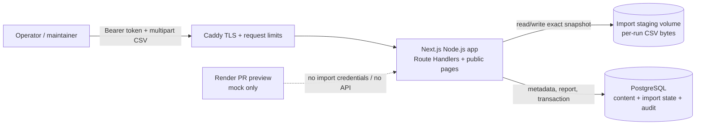
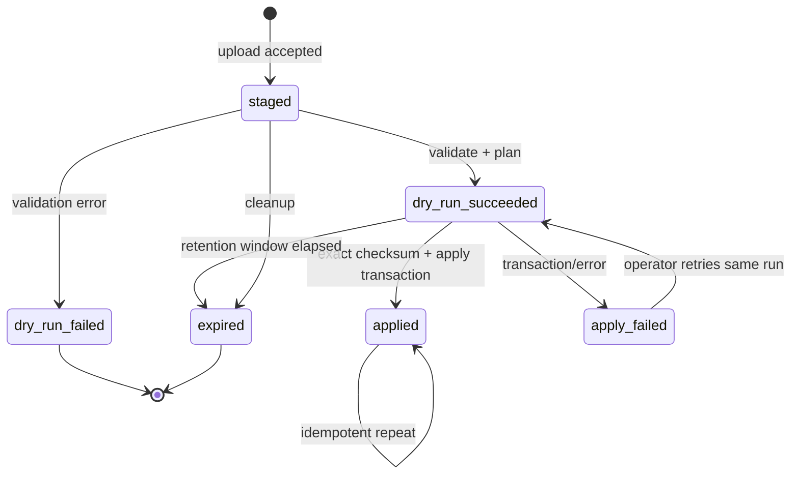
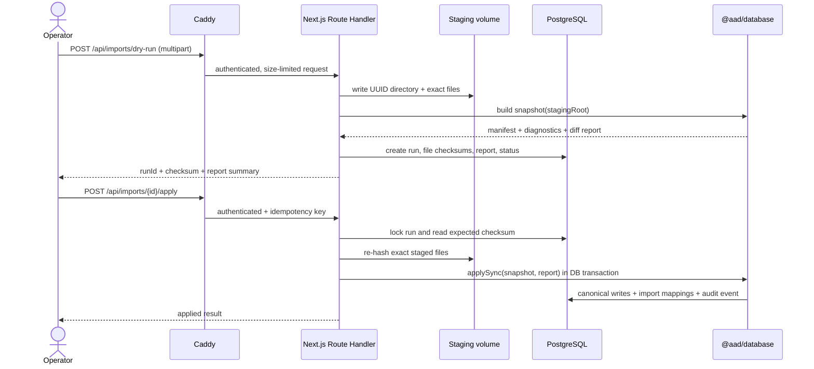

# Import API architecture

This document defines the M1 architecture to be implemented under [#107](https://github.com/Studio-Animal-Aided-Design/habitat-database/issues/107). The architecture decision is tracked in [ADR-005](adr-005-import-api-boundary.md) and [#119](https://github.com/Studio-Animal-Aided-Design/habitat-database/issues/119).

## Executive decision

The API is part of the existing Next.js application. A Node.js Route Handler authenticates an
operator, stages the uploaded converter files on a named volume, invokes the existing typed database
package for validation/dry-run/apply, and records the run in PostgreSQL. No separate API product,
queue or worker is required for M1.

The public Render mock-preview service is not an importer target. IONOS RC and production are the
deployment targets for this API, subject to the release process in #118.

## System context

Trust boundaries:

| Boundary | Rule |
| --- | --- |
| Internet → Caddy | TLS terminates here; reject oversized bodies and obvious request floods |
| Caddy → Next.js | Forward only the public host and standard proxy headers; do not forward secrets in URLs |
| Next.js → staging volume | App owns a per-run directory; path is generated from a UUID, never user input |
| Next.js → PostgreSQL | Use the existing server-only pool and parameterized queries; apply is one transaction |
| Render preview | Mock-backed UI only; no `IMPORT_API_*` secret and no route enabled for preview mode |

## API contract

The final route names are intentionally stable and narrow. Payloads are `multipart/form-data` for
upload and JSON for status/results. All responses include `Cache-Control: no-store`.

| Method | Endpoint | Purpose | Success |
| --- | --- | --- | --- |
| `POST` | `/api/imports/dry-run` | Upload a complete CSV snapshot, validate it and create a staged run | `201` with `runId`, manifest checksum, report summary and expiry |
| `GET` | `/api/imports/{runId}` | Read status/report metadata for an operator | `200` |
| `POST` | `/api/imports/{runId}/apply` | Re-check the staged bytes and apply the exact reviewed manifest | `200` with applied run id, or `409` on checksum/state conflict |

The caller sends `Authorization: Bearer <token>` and an `Idempotency-Key` on mutating requests. The
token never appears in a query string, form field, response or log. The upload must contain the
complete required dataset groups; partial uploads are rejected before any canonical write.

## Run state machine

Apply is allowed only from `dry_run_succeeded`. Before the transaction, the API recomputes every
file checksum and the manifest checksum. A changed or missing file returns `409` and cannot be
applied. A repeated apply for an already applied run returns the stored result rather than running
the importer again. Cleanup removes expired staging directories only after their database status is
terminal.

## Dry-run and apply sequence

## Data ownership and persistence

The existing content tables remain the source of truth for the public catalogue. Import metadata is
separate from content and must not be inferred from request logs.

| Data | Owner | Retention |
| --- | --- | --- |
| Uploaded CSV bytes | staging adapter / named volume | until apply or expiry; operator may explicitly purge a terminal run |
| Manifest and per-file checksums | PostgreSQL import-run records | retain with report for audit and troubleshooting |
| Dry-run report | PostgreSQL JSON plus downloadable server-side representation if needed | retain at least the operational review window |
| Canonical content | existing PostgreSQL tables | normal product retention |
| Operator actions | `audit_events` | normal operational/audit retention |

The implementation should add a migration for the run lifecycle and, if the existing `import_runs`
shape is retained, extend its status/report fields rather than duplicate an unrelated import table.
The currently supported `merge` and `sync` modes remain explicit request fields with a safe default
chosen by the operator workflow; the API must not silently infer `sync` from the upload.

## Security controls

- Require the import secret on every endpoint; fail closed when it is absent or the runtime is
  `preview`/mock.
- Compare the bearer value in constant time and return the same generic `401` for missing and invalid
  credentials.
- Set a strict multipart size, file-count, filename and total-duration limit. Accept only `.csv`
  files in the expected dataset layout and reject path traversal.
- Store UUID-based paths outside the public static directory. Do not expose arbitrary file reads.
- Use `Cache-Control: no-store`, disable indexing, and never include source rows or credentials in
  error messages intended for the browser.
- Add Caddy request limits and application-level rate limiting appropriate for a single maintainer.
- Record actor, action, run id, manifest checksum and outcome in the audit log, never the token.
- Keep the route disabled in Render's mock preview by configuration and by a runtime assertion.

## Failure and recovery rules

1. Upload or parser failure leaves no canonical writes; mark the run failed and allow a fresh run.
2. Dry-run success is reviewable but not an approval. Apply requires the run id, expected checksum and
   an explicit operator request.
3. Checksum drift, expired staging or a missing file returns `409`; the operator must upload again.
4. Database errors roll back the importer transaction. The run remains retryable when the staged bytes
   and report are still valid.
5. Process restart does not lose a staged run because bytes and metadata are persisted separately.
   A startup cleanup marks abandoned runs expired after the retention window.
6. If a later deployment uses multiple app replicas, replace the local staging adapter with a shared
   object store or a worker before enabling that topology.

## Implementation slices for #107

1. Extract database snapshot/apply functions behind an explicit `snapshotRoot` interface and export a
   typed report model for the web app.
2. Add the import-run migration, staging adapter, cleanup command and audit events.
3. Add the Node-runtime Route Handlers, bearer authentication, idempotency and response schemas.
4. Add Caddy limits, production-only configuration and integration tests against PostgreSQL.
5. Add an operator-facing minimal workflow: upload, inspect report/checksum, apply, verify public
   counts, and retain evidence for the release candidate.

## Deferred decisions

- multi-user accounts and role-based permissions;
- background jobs for large imports;
- shared object storage and multi-replica deployment;
- a browser-based editor or public import UI;
- automatic scheduling or webhook-triggered imports.
