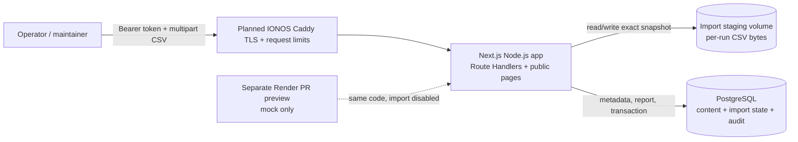
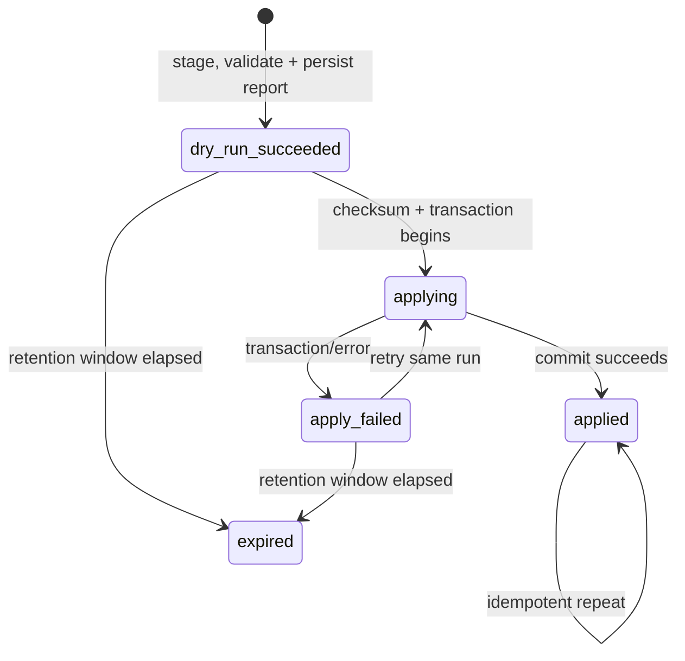
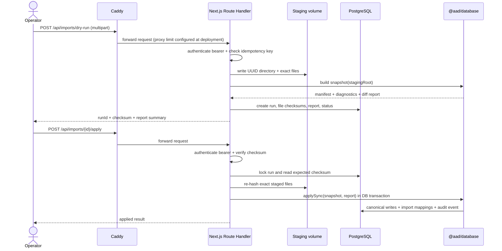

# Import API architecture

This document records the M1 architecture implemented under [#107](https://github.com/Studio-Animal-Aided-Design/habitat-database/issues/107) / PR #121. The architecture decision is tracked in [ADR-005](adr-005-import-api-boundary.md) and [#119](https://github.com/Studio-Animal-Aided-Design/habitat-database/issues/119). For current setup and exact request fields, see [import-api.md](import-api.md).

## Executive decision

The API is part of the existing Next.js application. A Node.js Route Handler authenticates an
operator, stages the uploaded converter files on a named volume, invokes the existing typed database
package for validation/dry-run/apply, and records the run in PostgreSQL. No separate API product,
queue or worker is required for M1.

The public Render mock-preview service is not an importer target. IONOS RC and production are the
planned deployment targets for this API, subject to the release process in #118.

## System context

```mermaid
flowchart LR
  operator[Operator / maintainer]
  caddy[Planned IONOS Caddy TLS + request limits]
  web[Next.js Node.js app\nRoute Handlers + public pages]
  staging[(Import staging volume\nper-run CSV bytes)]
  db[(PostgreSQL\ncontent + import state + audit)]
  render[Separate Render PR preview\nmock only]

  operator -->|Bearer token + multipart CSV| caddy --> web
  web -->|read/write exact snapshot| staging
  web -->|metadata, report, transaction| db
  render -.->|same code, import disabled| web
```

Trust boundaries:

| Boundary | Rule |
| --- | --- |
| Internet → Caddy (IONOS deployment) | TLS terminates here; configure body and request limits before enabling import |
| Caddy → Next.js | Forward only the public host and standard proxy headers; do not forward secrets in URLs |
| Next.js → staging volume | App owns a per-run directory; path is generated from a UUID, never user input |
| Next.js → PostgreSQL | Use the existing server-only pool and parameterized queries; apply is one transaction |
| Render preview | Mock-backed UI only; no `IMPORT_API_*` secret and no route enabled for preview mode |

## API contract

The route names are intentionally stable and narrow. Upload uses `multipart/form-data`, apply uses
JSON, and responses are JSON with `Cache-Control: no-store`.

| Method | Endpoint | Purpose | Success |
| --- | --- | --- | --- |
| `POST` | `/api/imports/dry-run` | Upload a complete CSV snapshot, validate it and create a staged run | `201` with a `run` object containing its id, manifest checksum, report and expiry |
| `GET` | `/api/imports/{runId}` | Read status/report metadata for an operator | `200` |
| `POST` | `/api/imports/{runId}/apply` | Re-check the staged bytes and apply the exact reviewed manifest | `200` with applied run; `409` on checksum/state conflict, `410` if expired |
| `GET` | `/api/imports/connection` | Verify feature enablement and bearer token from the converter settings panel | `200` |

The caller sends `Authorization: Bearer <token>` and an `Idempotency-Key` on mutating requests. Apply
also sends the reviewed `manifestChecksum` in its JSON body. Upload uses `mode=merge|sync` and
`file:<allowed-path>` multipart fields; the uploaded filename does not determine the server path.
The token never appears in a query string, form field, response or log. The upload must contain the
complete required dataset groups; partial uploads are rejected before any canonical write.

## Run state machine

```mermaid
stateDiagram-v2
  [*] --> dry_run_succeeded: stage, validate + persist report
  dry_run_succeeded --> applying: checksum + transaction begins
  applying --> applied: commit succeeds
  applying --> apply_failed: transaction/error
  apply_failed --> applying: retry same run
  dry_run_succeeded --> expired: retention window elapsed
  apply_failed --> expired: retention window elapsed
  applied --> applied: idempotent repeat
```

Invalid dry-runs are rejected and their temporary files removed without persisting a run. Apply can
start from `dry_run_succeeded` or retry from `apply_failed`. Before the transaction, the API rebuilds
the staged snapshot and compares its manifest checksum with the reviewed value. A changed file
returns `409` and cannot be applied. A repeated apply for an already applied run returns the stored
result. Expiry and staging cleanup currently happen when a run is accessed; there is no scheduled
cleanup of unvisited expired runs yet.

## Dry-run and apply sequence

```mermaid
sequenceDiagram
  actor O as Operator
  participant C as Caddy
  participant R as Next.js Route Handler
  participant S as Staging volume
  participant D as PostgreSQL
  participant I as @aad/database

  O->>C: POST /api/imports/dry-run (multipart)
  C->>R: forward request (proxy limit configured at deployment)
  R->>R: authenticate bearer + check idempotency key
  R->>S: write UUID directory + exact files
  R->>I: build snapshot(stagingRoot)
  I-->>R: manifest + diagnostics + diff report
  R->>D: create run, file checksums, report, status
  R-->>O: runId + checksum + report summary

  O->>C: POST /api/imports/{id}/apply
  C->>R: forward request
  R->>R: authenticate bearer + verify checksum
  R->>D: lock run and read expected checksum
  R->>S: re-hash exact staged files
  R->>I: applySync(snapshot, report) in DB transaction
  I->>D: canonical writes + import mappings + audit event
  R-->>O: applied result
```

## Data ownership and persistence

The existing content tables remain the source of truth for the public catalogue. Import metadata is
separate from content and must not be inferred from request logs.

| Data | Owner | Retention |
| --- | --- | --- |
| Uploaded CSV bytes | staging adapter / named volume | removed after successful apply or when an expired run is accessed |
| Manifest and per-file checksums | PostgreSQL import-run records | retain with report for audit and troubleshooting |
| Dry-run report | PostgreSQL JSON | retained with the run record |
| Canonical content | existing PostgreSQL tables | normal product retention |
| Operator actions | `audit_events` | normal operational/audit retention |

Migration `003_import_api_runs.sql` extends the existing `import_runs` table and reuses
`import_files` and `audit_events`. The supported `merge` and `sync` modes are explicit request
fields; the API defaults to `merge` and never infers `sync` from an upload.

## Security controls

- Require the import secret on every endpoint; fail closed when it is absent or the runtime is
  `preview`/mock.
- Store only a scrypt hash of the bearer token on the server and return the same generic `401` for
  missing and invalid credentials. Limit repeated failed authentication attempts per client address.
- Check upload byte and file-count limits. Accept only allow-listed logical CSV paths and reject
  path traversal. The current `request.formData()` parser may buffer a request in memory; configure a
  reverse-proxy body limit before exposing the IONOS endpoint.
- Store UUID-based paths outside the public static directory. Do not expose arbitrary file reads.
- Use `Cache-Control: no-store`, disable indexing, and never include source rows or credentials in
  error messages intended for the browser.
- Configure Caddy request limits as part of IONOS provisioning; the app currently limits failed
  authentication attempts.
- Record import actions, run ids, checksums and outcomes where available in the audit log, never the
  token. The shared token does not identify individual actors.
- Keep the import API disabled in Render's mock preview through `IMPORT_API_ENABLED=false`, no
  import secret and the PostgreSQL adapter requirement for enablement.

## Failure and recovery rules

1. Upload or parser failure leaves no canonical writes; remove temporary files and allow a fresh run.
2. Dry-run success is reviewable but not an approval. Apply requires the run id, expected checksum and
   an explicit operator request.
3. Checksum drift returns `409`, an expired run returns `410`, and an invalid or missing staged file
   returns `422`; the operator must upload again.
4. Database errors roll back the importer transaction. The run remains retryable when the staged bytes
   and report are still valid.
5. Process restart does not lose a staged run because bytes and metadata are persisted separately.
   Access to an expired run marks it expired and removes its staged files. Automatic cleanup of
   unvisited expired runs remains deployment follow-up work.
6. If a later deployment uses multiple app replicas, replace the local staging adapter with a shared
   object store or a worker before enabling that topology.

## Implementation status after #121

- The typed database import library, run migration, staging adapter, audit events, Node.js Route
  Handlers, bearer authentication, idempotency checks and converter UI are implemented.
- Local PostgreSQL end-to-end import was verified in #121. The API is disabled by default and on
  Render mock previews.
- IONOS volume and reverse-proxy configuration, automatic cleanup of unvisited expired runs, secret
  rotation and release-candidate operating checks remain deployment work under #105/#117.

## Deferred decisions

- multi-user accounts and role-based permissions;
- background jobs for large imports;
- shared object storage and multi-replica deployment;
- a browser-based editor or public import UI;
- automatic scheduling or webhook-triggered imports.
